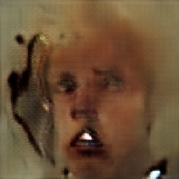
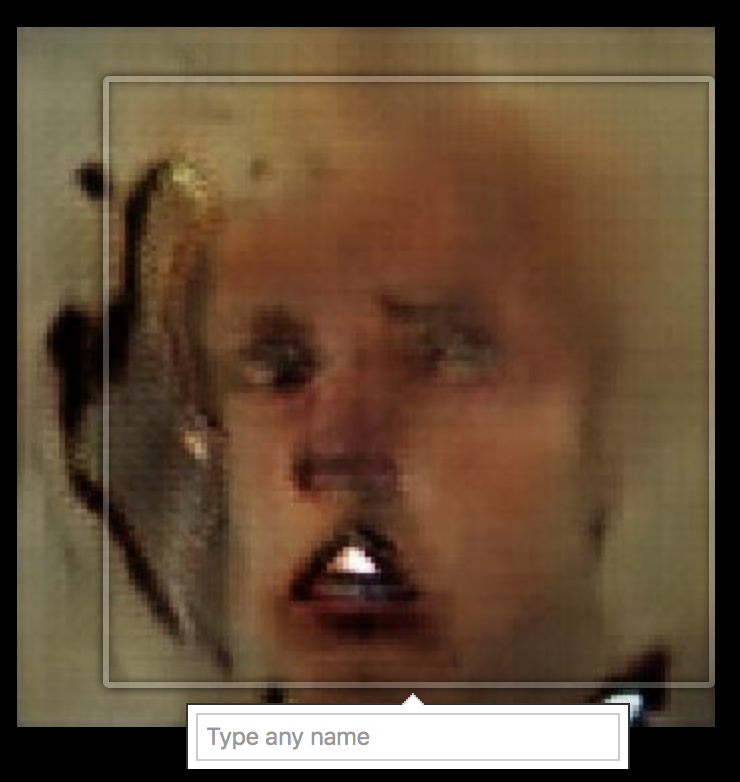
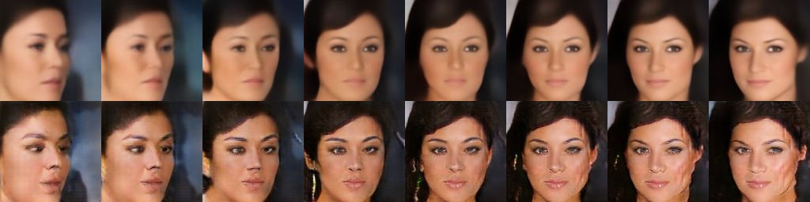
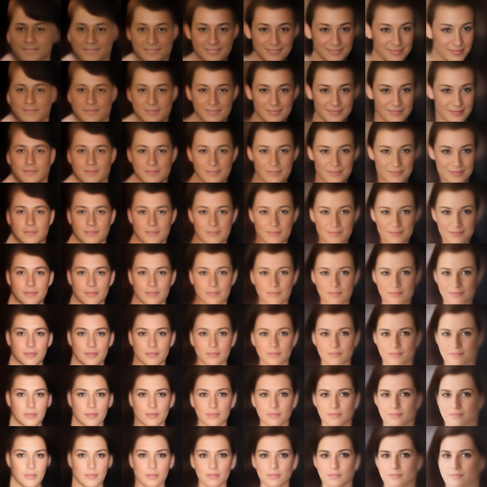
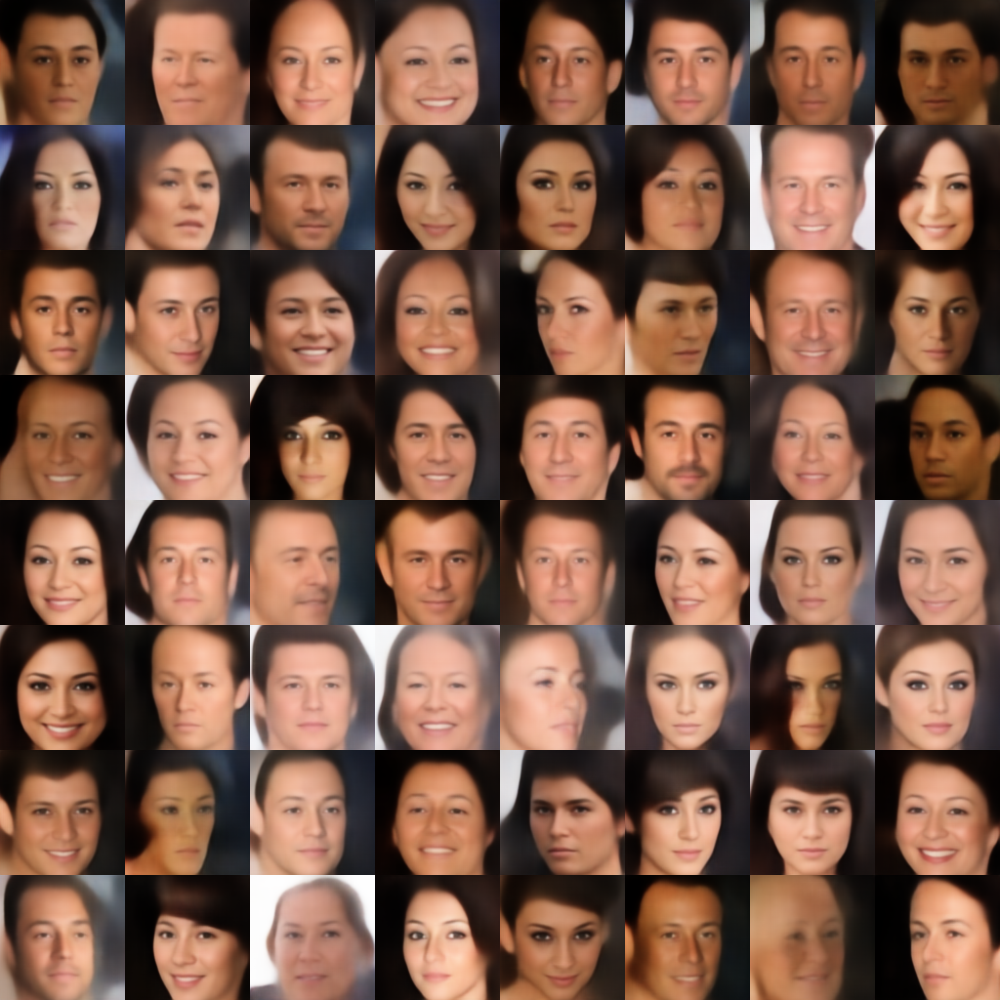

# Replicated "BEGAN: Boundary Equilibrium Generative Adversarial Networks"

## Share Commands:

* **image-size**: Size of training image (64/128). The default size is 128.
* **seed-size**: Size of random seed (z). The default size is 64.
* **embedding-size**: Size of the bottlenect of the autoencoder discriminator. The default size is 64.
* **mysterious-n**: Number of filters. The *n* in figure 1. The default number is 128.
* **diversity-ratio**: The diversity ratio. The default value is 0.7.
* **k-learning-rate**: The learning rate of k (to keep boundary equilibrium). The default value is 0.001.

## Train


python -m began.train


### commands:

* **portraits-dir-path**: Source directory of all images.
* **logs-dir-path**: Directory to log for tensorflow.
* **checkpoints-dir-path**: Directory to keep checkpoints.
* **need-crop-image**: True if the images in portraits directory need to be cropped.
* **image-offset-x**: Left offset for image cropping.
* **image-offset-y**: Top offset for image cropping.
* **summary-row-size**: Number of rows to build the image summaries.
* **summary-col-size**: Number of columns to build the image summaries.
* **batch-size**: Batch size. The default value is 16.

### Notes

* learning rate decay is not implemented.

###  (´Ａ｀。)

Facebook asked me to tag him  XD

## Embed


python -m began.embed


TBD

## Shift


python -m began.shift


### commands:

* **experiment**:
  * interp_linear: generate linear interpolated result.
  * interp_bilinear: generate bilinear interpolated result.
  * random: generate random result.
* **checkpoint-path**: Path to the pre-trained checkpoint.
* **result-path**: Path for the newly generated result.
* **experiment-size**: Size of row/columns of the result images.
* **vector-0-path**: Path to the 1st vector. Use a random uniform vector if the path is invalid.
* **vector-1-path**: Path to the 2nd vector. Use a random uniform vector if the path is invalid.
* **vector-2-path**: Path to the 3rd vector. Use a random uniform vector if the path is invalid.
* **vector-3-path**: Path to the 4th vector. Use a random uniform vector if the path is invalid.

Generated with 2 random vectors and their interpolations. The first row is from the discriminator while the second row is from the generator.

Generated with 4 random vectors and their interpolations.

Generated with 4 random vectors and their interpolations (the 2 on the top are the same with the previous example, so the first rows from both examples are the same).

Generated with 64 random vectors:

## Crop

To crop celebA dataset (png, [25, 50, 128, 128]).


python -m began.cropper


### commands

* **--source-dir-path**: Source directory of **img_align_celeba_png** of CelebA.
* **--target-dir-path**: Target directory to keep the cropped face images.
* **--image-scale**: New size of the cropped images. The default is 128.

## CelebA

[Large-scale CelebFaces Attributes (CelebA) Dataset](http://mmlab.ie.cuhk.edu.hk/projects/CelebA.html)
