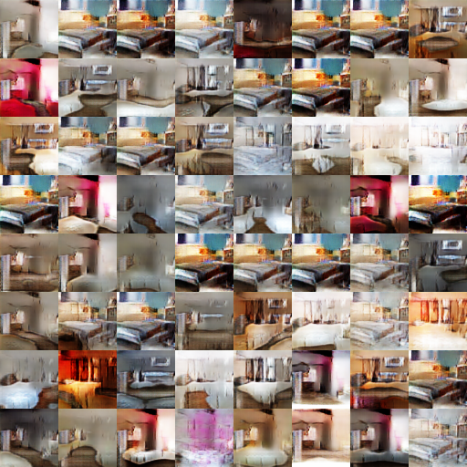
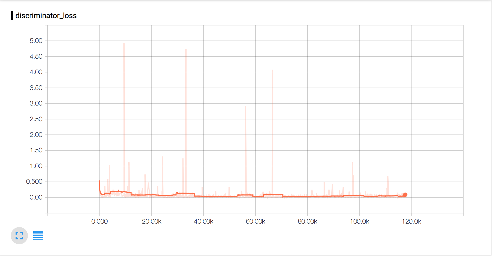
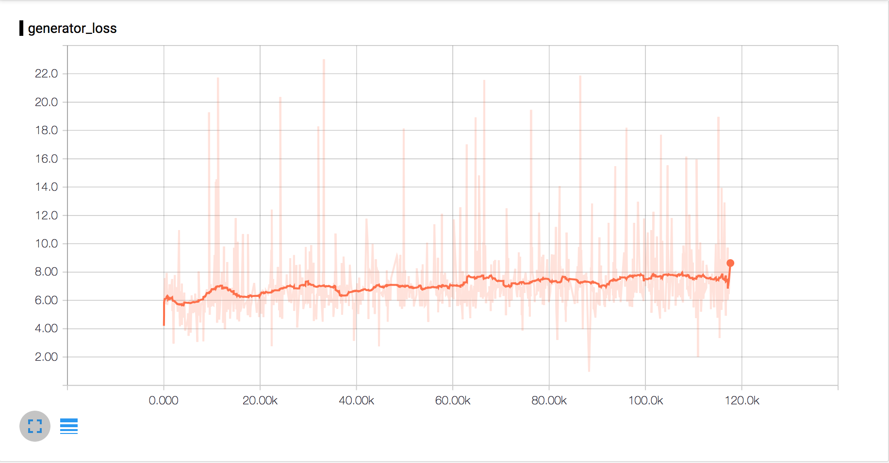
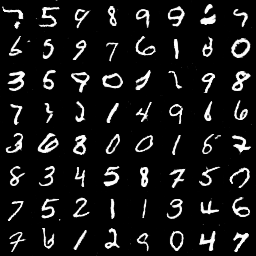
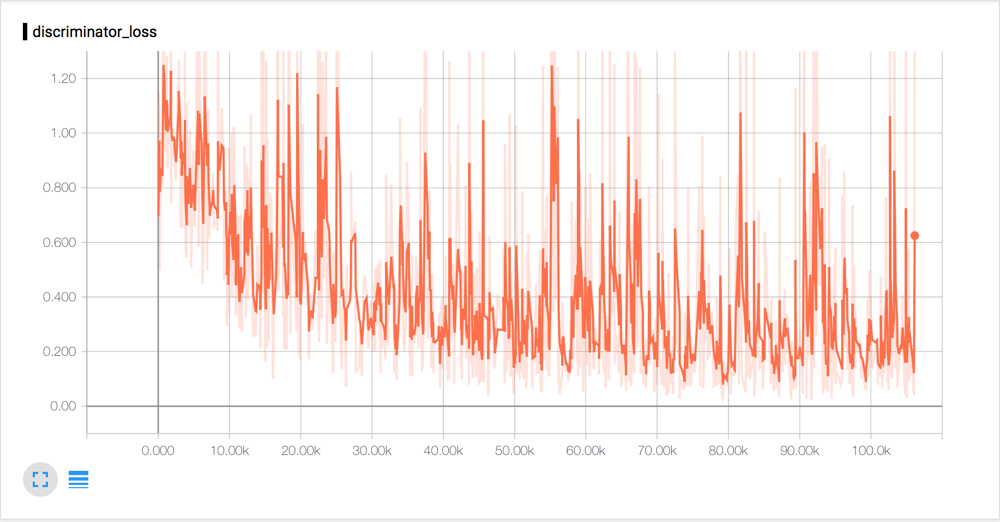
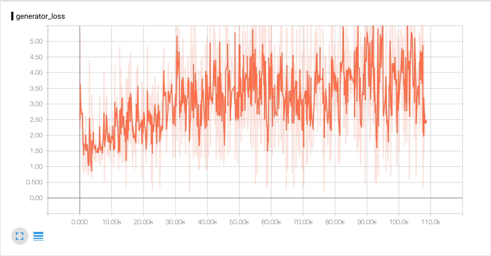

# Replicated "Unsupervised Representation Learning with Deep Convolutional Generative Adversarial Networks"

## Commands

python -m dcgan.dcgan

* **logs-dir-path** : path to the directory for tensorboard logs.
* **checkpoints-dir-path** : path to the directory for checkpoints.
* **use-lsun** : True to use LSUN bedroom training dataset. Use MNIST else.
* **batch-size** : size of each training batch.
* **seed-size** : size of z for generator.
* **summary-row-size** : number of rows of generated image summary.
* **summary-col-size** : number of columns of generated image summary.

## Notes

* MNIST and LSUN datasets need different learning rate since they have different number for parameters to train.

## Results

### LSUN Bedroom

learning rate = 0.00002

### MNIST

learning rate = 0.0002

