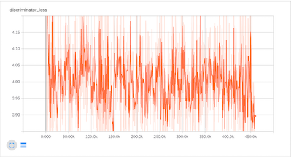
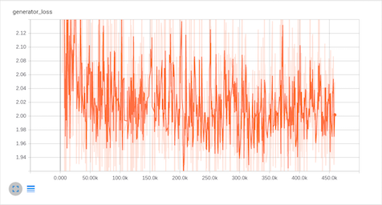
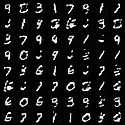
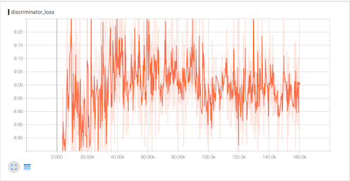
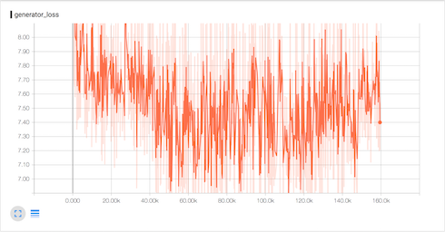
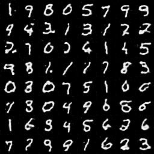
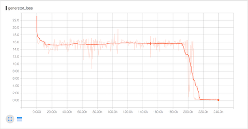
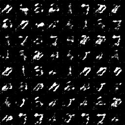
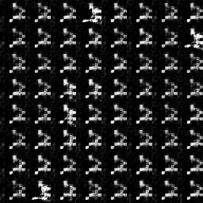

# Replicated "Energy-Based Generative Adversarial Networks"

---

## Notes:

* This paper is very interesting. It made me think about many things and I finally felt the **loss function**.
* In my point of view, EBGAN trys to build a discriminator to encode/decode specified images. The discriminator is trained to be good at encode/decode mnist dataset but bad at the other images. The generator is trained to generate images that can be encode/decode by the discriminator.
* I did not pay much attention on the **tanh** layer in the generator. We need it because we want to map the final pixel values to -1.0 ~ +1.0.
* Two layer autoencoder was built in the beginning. But it did not work because it's too difficult to extract features (encoder) with only 2 layers.
* The **margin** (M) does matter.

---

## M=2

---

## M=8

---

## M=16

After about 20k steps, the generator started to generated meaningful digit images. The loss of discriminator is about 16.0 while the loss of generator is about 15.0. The margin is 16.0. So both loss of discriminator and generator are roughly the same (discriminator can not tell the difference between real and generated images).

However, keep training would crash the discriminator. The stronger generator raises loss of discriminator because of margin. If the generator is strong enough, the low generator loss introduce high margin loss for discriminator. Eventually, all losses were shifted to the discriminator (~33.0). And it easier for the autoencoder to shift its function to encode/decode generated images to minimize discriminator loss. Then the network dead. (eventually, all generated images become black).

So I changed the margin to 8.0 and 2.0 and got better results.

---
