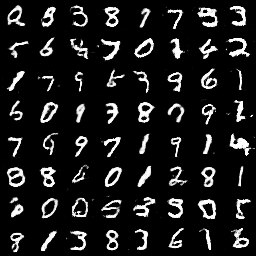
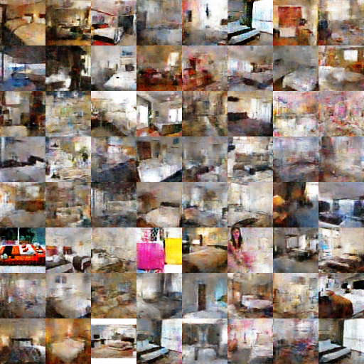
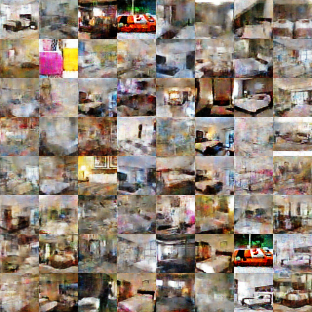
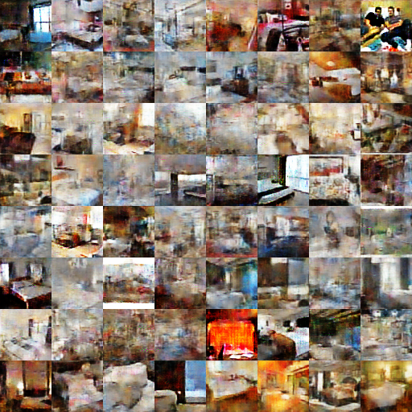
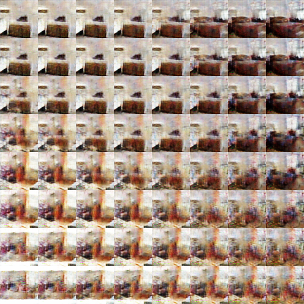

# Replicated "Improved Training of Wasserstein GANs"

## Commands
python -m xwgan.xwgan_lsun

* **--logs-dir-path** : path to the directory for tensorboard.
* **--outputs-dir-path** : path to the directory for generated images.
* **--checkpoints-dir-path** : path to the directory to keep and load checkpoints.
* **--batch-size** : batch size of training / generating size.
* **--seed-size** : size of seed for fake images.
* **--summary-row-size** : number of images in the row of summary / generated images.
* **--summary-col-size** : number of images in the column of summary / generated images.

## Things to Note
* For LSUN bedroom dataset, both discriminator and generator networks are simplified (less channels).
* During the training on LSUN bedroom dataset, it's very easy to encounter NAN issues (not a number). It's caused by get gradients on interpolated image between real and fake images (for gradient penalty). However, remove all batch norm layers also remove this issue.
* There are some similar rooms and there are people. Some rooms are easily generated (check the attached results). It feels like the generator actually remembers some features (or almost entire room) in training data (but all papers said it would not ??).

## Results

Trained on MNIST dataset.

Trained on LSUN bedroom dataset. I do not like the result though. There are similar rooms. And there are people. It feels like the G network just remembered some training data.

